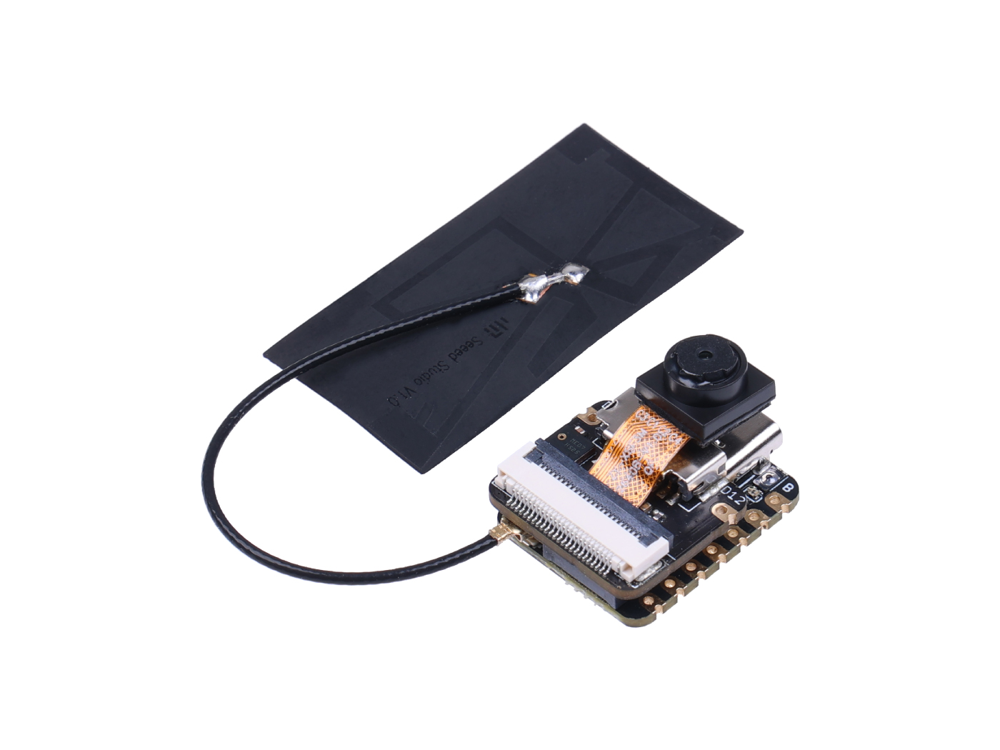
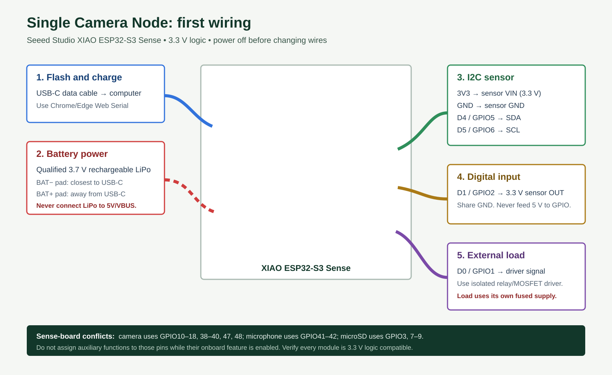
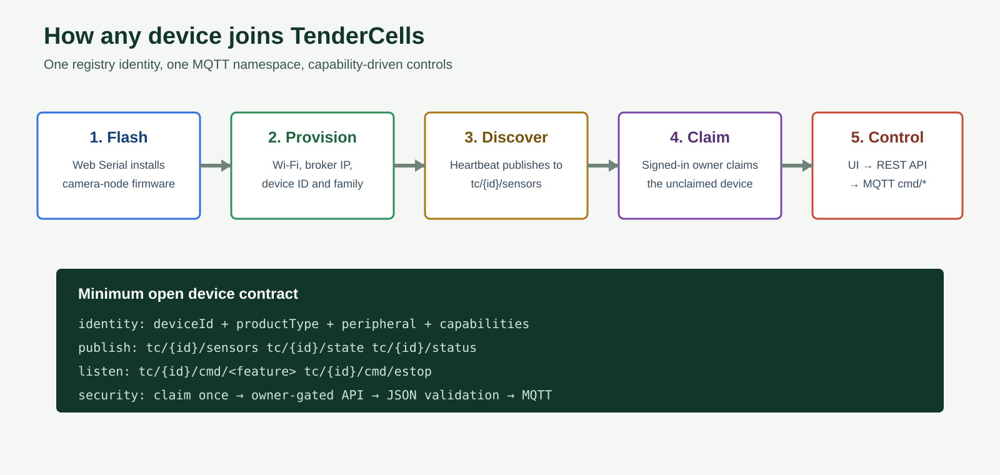

# Single Camera Node: First Build and Device Registry Guide

This is the first physical TenderCells build for students, makers, and open-source
contributors: one battery-powered Seeed Studio XIAO ESP32-S3 Sense, one camera,
and one named device in the TenderCells UI. The same registry and MQTT contract is
the path for future sensors, feeders, relays, robots, and custom devices.

> Start camera-only. Prove flash, Wi-Fi, MQTT, ownership, and live video before
> adding an auxiliary sensor or load.



The photograph above is Seeed Studio's official product image. Current Sense kits
use an OV3660 camera; older kits may have OV2640. TenderCells firmware supports the
same camera interface for both. See the [official Seeed getting-started guide](https://wiki.seeedstudio.com/xiao_esp32s3_getting_started/).

## What is on this board

| Capability | On XIAO ESP32-S3 Sense | TenderCells first build |
|---|---:|---|
| Camera | Yes, OV3660 on current boards | Live MJPEG at `/stream` |
| Digital microphone | Yes, PDM on GPIO41/42 | Optional capability for compatible routines |
| microSD | Yes, SPI on GPIO3 and GPIO7-9 | Optional local-storage capability |
| Wi-Fi / BLE | Yes | Wi-Fi carries MQTT and video |
| LiPo charging | Yes | Qualified 3.7 V rechargeable LiPo only |
| Battery percentage | No direct measurement | Requires a separately designed voltage-sense circuit |
| General GPIO | Yes | Only pins not reserved by enabled onboard functions |


The pinout image is Seeed Studio's official pin map. Camera, microphone, and
microSD share chip resources. Do not treat every printed GPIO as simultaneously
free.

## Engineering status

This is a reference design for supervised prototyping, not a certified product
assembly. Before field use, the builder owns component selection, insulation,
strain relief, enclosure ingress protection, thermal testing, battery protection,
and compliance for the final jurisdiction. Never use this reference for life-safety
monitoring or direct control of mains wiring.

### Reference BOM

| Ref | Part | Electrical requirement |
|---|---|---|
| A1 | Seeed Studio XIAO ESP32-S3 Sense | Genuine board and seated Sense expansion |
| CAM1 | OV3660 or legacy OV2640 camera | Correct FFC orientation and locked connector |
| ANT1 | Supplied 2.4 GHz antenna | U.FL plug seated vertically; cable strain relieved |
| J1 | USB-C cable | Data-capable; 5 V USB source |
| B1 | Protected single-cell LiPo | Nominal 3.7 V; insulated leads; correct polarity |
| S1 | Optional BME280-class I2C breakout | 3.3 V logic; no 5 V-only pull-ups |
| Q1 | Optional logic-level N-MOSFET driver | Fully enhanced at 3.3 V gate drive |
| R1 | MOSFET gate resistor | 100-330 ohm |
| R2 | MOSFET gate pulldown | 47-100 kohm |
| D1 | Flyback diode for inductive DC load | Rated above load current and reverse voltage |
| F1 | Load-branch fuse | Sized below wire and supply ratings |

## First-function wiring



### Camera-only build

1. Seat the Sense expansion board fully on the XIAO board-to-board connector.
2. Lock the camera ribbon into its connector with contacts in the orientation shown
   by Seeed's camera guide. Do not insert or remove it while powered.
3. Attach the supplied 2.4 GHz antenna to the U.FL connector using straight,
   downward pressure. Do not lever the connector sideways.
4. Connect a USB-C **data** cable. Use USB for the first flash and configuration.
5. After bench testing, connect a qualified protected 3.7 V rechargeable LiPo to
   the underside battery pads: negative nearest USB-C, positive away from USB-C.
6. Insulate solder joints, add strain relief, and place the assembly in a
   ventilated nonconductive enclosure with the lens unobstructed.

Never connect a LiPo directly to `5V/VBUS`. When running from battery, Seeed notes
that the 5 V pin has no output. Do not power motors, pumps, heaters, or solenoids
from the XIAO regulator.

## Optional auxiliary wiring

Add only one new function at a time, power off first, and select the same
capability in the UI.

### I2C temperature/humidity sensor

Use a sensor breakout explicitly rated for 3.3 V logic.

| XIAO pin | Sensor pin | Purpose |
|---|---|---|
| `3V3` | `VIN` or `3V3` | Sensor power |
| `GND` | `GND` | Common reference |
| `D4 / GPIO5` | `SDA` | I2C data |
| `D5 / GPIO6` | `SCL` | I2C clock |

Register `temperature` and/or `humidity` capabilities only after the sensor is
physically present and its firmware driver publishes those fields. Temperature
alert controls must remain absent until then.

Many breakout boards already contain I2C pull-ups. With power removed, inspect the
module schematic before adding another pair. Pull-ups must terminate at 3.3 V, not
5 V. Keep student jumper wiring short; for a field enclosure, use a locking
connector and validate the bus with the intended cable length.

### Digital input

For a 3.3 V PIR, reed switch, float switch, or similar digital module, use
`D1 / GPIO2` for signal and share `GND`. A dry switch normally needs a pull-up or
pull-down configured in firmware. Never feed 5 V into a GPIO.

### Relay, lamp, fan, or pump

Use `D0 / GPIO1` only as a logic signal into a 3.3 V-compatible opto-isolated relay
or MOSFET driver. The load requires its own correctly sized, fused supply. Motors
and coils need flyback protection. Students must not work with mains voltage.

For a low-side DC MOSFET stage: connect `D0` through `R1` to the gate, connect `R2`
from gate to ground, source to logic/load ground, and drain to the load negative.
Place the flyback diode directly across an inductive load with its cathode toward
load positive. Tie grounds only where the selected isolated/non-isolated driver
requires it. Do not route load current through a XIAO ground pin or PCB trace.

### Reserved Sense pins

| Enabled function | Reserved pins |
|---|---|
| Camera | GPIO10-18, GPIO38-40, GPIO47, and GPIO48 |
| Digital microphone | GPIO41-42 |
| microSD | GPIO3 and GPIO7-9 |

## Flash and register in the UI

1. Sign in to TenderCells and open **Products**.
2. Choose **Add Your First Device** and select **DIY ESP32 Camera Node**.
3. Select **Seeed XIAO ESP32-S3 Sense** and the **Camera only** starter setup.
4. Choose **1. Flash Camera**. In Chrome or Edge, connect the XIAO serial port and
   install the `camera-node` image.
5. Join the temporary `TenderCam-Setup` Wi-Fi network.
6. Enter 2.4 GHz Wi-Fi, broker address when auto-discovery is unavailable, a unique
   device ID, and product type `camera-kit`.
7. Return to TenderCells and choose **2. Register Camera**. Give it a human name and
   location. Use a device ID containing only letters, digits, `_`, or `-`.
8. Claim the discovered device while signed in. First claim wins; control API calls
   are then owner-gated.
9. Open the product dashboard. Add the reported `http://<device-ip>/stream` URL if
   it was not discovered automatically.
10. Confirm live video, online state, and heartbeat before enabling another board
    capability.

## Device registry record

The registry describes what the hardware actually has and which functions the user
enabled. Do not register aspirational hardware.

```json
{
  "product_type": "automation_device",
  "product_name": "Back Garden Camera",
  "device_id": "garden_cam_01",
  "model": "Seeed XIAO ESP32-S3 Sense",
  "location": "Back garden",
  "metadata": {
    "product_family": "camera-kit",
    "build_source": "open-source-diy",
    "controller_board": "Seeed XIAO ESP32-S3 Sense",
    "firmware_target": "firmware/camera-node",
    "hardware_capabilities": ["camera", "microphone", "microsd", "wifi", "ble", "gpio", "battery_power"],
    "enabled_capabilities": ["camera", "wifi", "ble", "battery_power"],
    "capability_profile": "camera_only",
    "power_source": "Rechargeable 3.7 V LiPo",
    "camera_module": "OV3660",
    "mqtt_base_topic": "tc/garden_cam_01"
  }
}
```

## How every TenderCells device connects



A custom device becomes usable when it implements this minimum contract:

1. Maintain a stable unique `deviceId` and report `productType`, `peripheral`, and
   real capabilities in heartbeat telemetry.
2. Publish JSON telemetry to `tc/{id}/sensors`, state to `tc/{id}/state`, and
   retained online status to `tc/{id}/status`.
3. Subscribe only to commands the hardware can perform under
   `tc/{id}/cmd/<feature>` and always subscribe to E-stop when actuators exist.
4. Use the TenderCells API as the authenticated control bridge. UI controls call
   REST; the API validates ownership and payloads, then publishes MQTT.
5. Advertise only physically installed capabilities. The UI must hide or disable
   controls for absent hardware.
6. Register auxiliary modules separately when they have their own controller,
   firmware lifecycle, power supply, or safety boundary.

Camera-node capability changes use:

```text
POST /api/mqtt/devices/{deviceId}/camera/config
tc/{deviceId}/cmd/camera/config
{"enabled":["camera","wifi","battery_power"]}
```

For the complete topic and API contract, continue to [Connect a Device](CONNECT_A_DEVICE.md).

## Verification checklist

- [ ] USB data connection flashes successfully.
- [ ] `TenderCam-Setup` provisions 2.4 GHz Wi-Fi.
- [ ] Device publishes a heartbeat every 10 seconds.
- [ ] Device appears unclaimed, then binds to the signed-in owner.
- [ ] Registry capabilities match installed hardware.
- [ ] Live stream opens on the local network.
- [ ] UI feature switch produces `tc/{id}/cmd/camera/config`.
- [ ] Reboot preserves the selected configuration.
- [ ] Removing a physical module also removes its registry capability.

### Electrical acceptance checks

- [ ] Continuity test finds no short between `3V3` and `GND` before power-up.
- [ ] Bench supply current limit is enabled for first auxiliary-power test.
- [ ] Measured `3V3` remains in regulation during Wi-Fi connection and camera capture.
- [ ] LiPo polarity is verified twice at the board pads before soldering.
- [ ] Camera peak load does not reset the board on the selected battery and wiring.
- [ ] Load switching produces no ESP32 reset, false GPIO trigger, or visible supply dip.
- [ ] Inductive load has a correctly oriented flyback diode or rated suppression.
- [ ] High-current wiring is fused, strain relieved, and physically separated from logic.
- [ ] Enclosure temperature is measured in the intended sun/weather/load condition.
- [ ] The device fails safe after Wi-Fi, broker, sensor, and power interruptions.

## Sources and image attribution

- [Seeed Studio XIAO ESP32-S3 getting started, battery guidance, schematics, and pinout](https://wiki.seeedstudio.com/xiao_esp32s3_getting_started/)
- [Seeed Studio XIAO ESP32-S3 pin multiplexing](https://wiki.seeedstudio.com/xiao_esp32s3_pin_multiplexing/)
- [Seeed Studio camera usage](https://wiki.seeedstudio.com/xiao_esp32s3_camera_usage/)
- [Seeed Studio microphone usage](https://wiki.seeedstudio.com/xiao_esp32s3_sense_mic/)
- [Seeed Studio microSD usage](https://wiki.seeedstudio.com/xiao_esp32s3_sense_filesystem/)

The two Seeed product images in `docs/assets/camera-node/` are adapted or
redistributed from Seeed Studio's public wiki under
[CC BY-SA 4.0](https://creativecommons.org/licenses/by-sa/4.0/), with attribution
to Seeed Studio. TenderCells-authored SVG diagrams that incorporate those images
are also distributed under CC BY-SA 4.0. Other original TenderCells documentation
remains under the repository's license.
