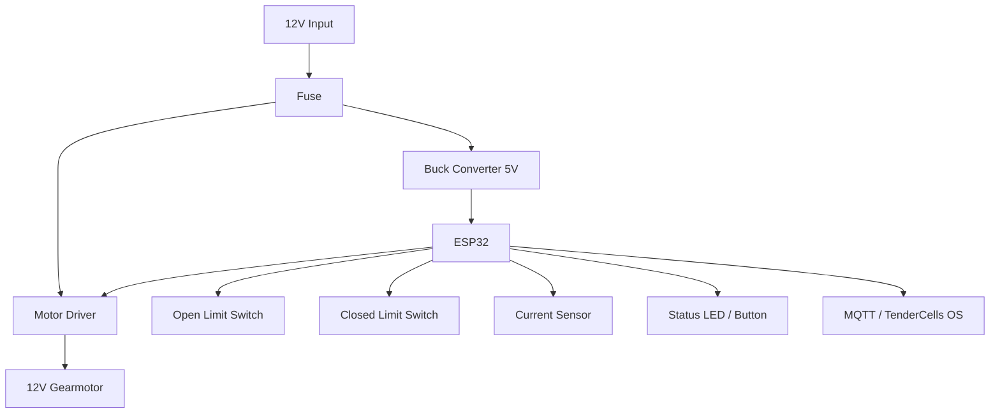
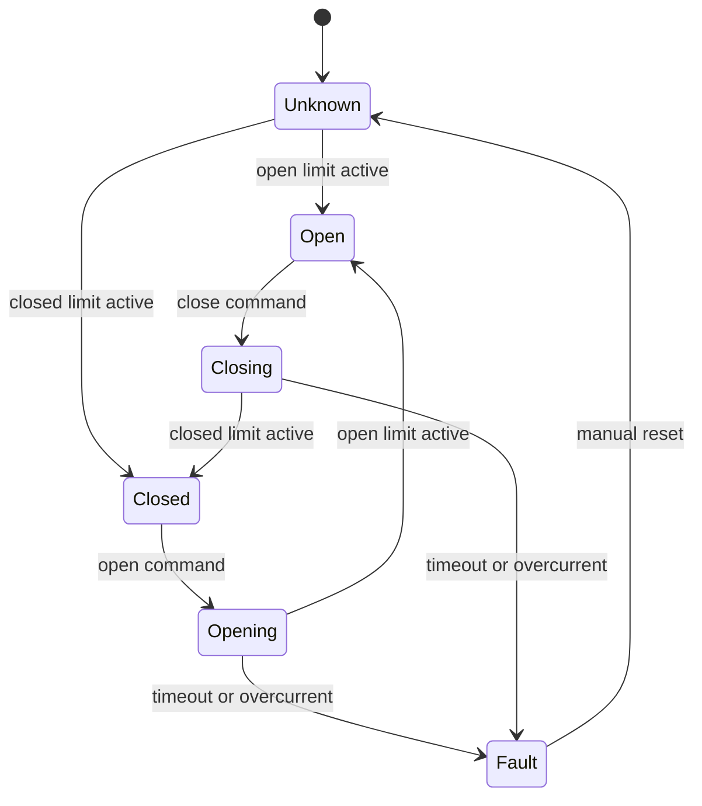

# DoorCell V1.4 Electronics

## Recommended Control Stack

- ESP32 DevKitC or ESP32-WROOM board.
- DRV8871 DC motor driver.
- 12V 25GA-370/JGA25-370 encoder gearmotor.
- INA219 or ACS712 current sensor.
- Two limit switches.
- 12V power input.
- LM2596 buck converter to 5V.
- Optional HiLetgo/CN3065 Solar Charger v1.0 module inside the main controller enclosure.
- Optional BME280/SHT31 sensor.
- Optional MQTT connection to TenderCells OS.

## Sub-$100 Basic Electronics Package

DoorCell Basic uses off-the-shelf modules so a user can print the assembly and buy inexpensive electronics without waiting on a custom PCB.

| Module | CAD Envelope | Mounting Strategy | Why It Is Included |
| --- | ---: | --- | --- |
| ESP32 dev board | 58 x 31 x 8 mm | Clip/zip-tie tray | Wi-Fi, local logic, TenderCells OS pairing |
| DRV8871 motor driver | 31 x 26 x 7 mm | Clip/zip-tie tray | Reversible 12V gearmotor control |
| INA219 or ACS712 | 26 x 22 x 7 mm | Clip/zip-tie tray | Obstruction/current detection |
| LM2596 buck converter | 44 x 22 x 14 mm | Clip/zip-tie tray | 12V to 5V logic supply |
| CN3065 solar charger | 44 x 24 x 8 mm | M3 brass-insert hold-down posts | Optional 1S LiPo solar charge path |
| Inline fuse holder | 45 x 15 x 14 mm | Printed service channel | Wiring fault protection |
| 25GA/JGA25-370 motor | 25 mm body, 65 mm body length plus encoder relief | Printed cassette | Rack-and-pinion drive |
| Limit switches | project-specific | Printed brackets | Hard open/closed confirmation |

Controller pod outside size: **170 x 115 x 46 mm**.

Cable entry:

- M12 gland 1: 12V power input.
- M12 gland 2: motor leads.
- M10 gland 1: limit switches, button, sensor leads.
- M8 gland 1: optional solar panel leads.
- M8 gland 2: optional 1S battery/service leads.
- 16.2 mm side cutout: optional waterproof local button.

The printed pod uses trays plus M3 brass heat-set insert posts because low-cost ESP32, DRV8871, INA219/ACS712, LM2596, and CN3065 modules vary slightly by vendor.

## Optional Solar Lite Add-On

Solar Lite is designed around:

| Item | Target |
| --- | ---: |
| Solar panel | 6V, 3W, 500mA nominal |
| Panel size | 145 x 145 mm |
| Charger module | CN3065 Solar Charger v1.0 |
| Charger input | 4.4-6V solar input |
| Charge current | up to 500mA |
| Charger board class | 20 x 40 mm nominal, 44 x 24 mm CAD envelope |

The CN3065 charges a single-cell LiPo/Li-ion path. It is not a 12V motor power supply. A self-contained solar door needs a validated battery, boost converter, low-voltage cutoff, sleep firmware, and cold-weather testing before unattended animal use.

Reference notes:

- Common Solar Charger v1.0 / CN3065 boards are listed with 4.4-6V solar input, 500mA max charge current, PH 2.0 connectors, and about 2 x 4 cm size.
- The attached reference panel is a 6V 3W 500mA mini panel with a 145 x 145 mm nominal body.

## Wiring Overview



## Power Budget

| Load | Typical | Design Allowance |
| --- | ---: | ---: |
| ESP32 + sensors | 100-250 mA at 5V | 500 mA at 5V |
| 25GA gearmotor moving | 250-900 mA at 12V | 1.5A at 12V |
| 25GA gearmotor stall | motor dependent | stop by current/timeout |
| Status LED/button | below 50 mA | 100 mA |
| CN3065 solar charge path | up to 500mA charge | optional 1S battery only |

Use a **12V 2A supply** for Basic. Use a **2A inline fuse** to protect the wiring. Current sensing is still required; the fuse is not an obstruction sensor.

## Mechanical Integration Notes

- Keep motor wires twisted and separated from limit switch leads where practical.
- Add a drip loop before every cable gland.
- Use stranded 22 AWG wire for switch/sensor leads.
- Use stranded 20 to 22 AWG wire for the short motor run.
- Keep the LM2596 module away from the low-voltage sensor leads.
- Add conformal coating only after bench testing and calibration.
- Do not seal the controller box permanently; the fuse and modules must remain serviceable.

## Suggested ESP32 Pins

| Function | ESP32 Pin | Notes |
| --- | --- | --- |
| Motor IN1 | GPIO 25 | DRV8871 direction/PWM |
| Motor IN2 | GPIO 26 | DRV8871 direction/PWM |
| Open limit | GPIO 32 | Pull-up input |
| Closed limit | GPIO 33 | Pull-up input |
| Manual button | GPIO 27 | Pull-up input |
| Status LED | GPIO 2 | Onboard or external |
| INA219 SDA | GPIO 21 | I2C |
| INA219 SCL | GPIO 22 | I2C |
| Encoder A | GPIO 34 | Input only |
| Encoder B | GPIO 35 | Input only |

## MQTT Topic Pattern

Use a TenderCells topic pattern:

| Topic | Direction | Example Payload |
| --- | --- | --- |
| `tc/{deviceId}/cmd/door` | OS to device | `{ "state": "open" }` |
| `tc/{deviceId}/cmd/estop` | OS to device | `{ "active": true }` |
| `tc/{deviceId}/state` | Device to OS | `{ "door": "closed", "motor": "idle" }` |
| `tc/{deviceId}/sensors` | Device to OS | `{ "currentA": 0.4, "batteryV": 12.1 }` |
| `tc/{deviceId}/alert` | Device to OS | `{ "type": "obstruction" }` |

## Door State Machine



## Safety Logic

Minimum required safety logic:

- Stop motor when open limit triggers.
- Stop motor when closed limit triggers.
- Stop motor on timeout.
- Stop motor on current spike.
- Reverse slightly after obstruction during close.
- Mark state unknown after boot until a limit switch is seen.
- Reject close command if state is unknown unless user confirms local calibration.
- Log every open/close command.

## Firmware Behavior

Pseudo logic:

```text
on boot:
  connect wifi
  connect mqtt
  read limit switches
  publish state

open command:
  if already open, publish open
  drive motor open direction
  stop on open limit, timeout, or overcurrent

close command:
  require safety policy
  drive motor close direction
  stop on closed limit
  reverse/stop on obstruction

estop command:
  disable motor driver
  publish estop state
```
