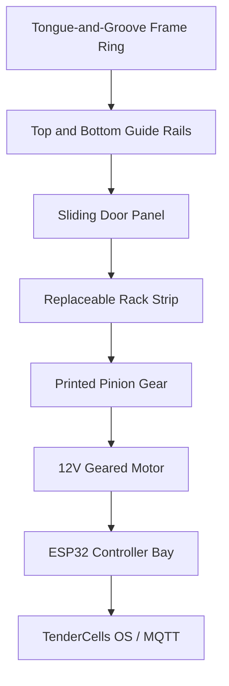

# TenderCells DoorCell V1.4

Open-source 3D printable smart coop door assembly inspired by the broad sliding-door product category, but designed as a TenderCells-owned printable system.

This is a prototype design package for a horizontal rack-and-pinion smart door. It is intended for home printing, school builds, 4-H/FFA projects, and a future TenderCells kit.

## Design Goals

- Printable on common 220 x 220 mm beds by splitting the frame into tongue-and-groove sections.
- Horizontal sliding door with guided top and bottom tracks.
- Module-based rack-and-pinion drive mounted to the moving door panel.
- Replaceable printed rack teeth.
- Real electronics pockets and mounts, not vague placeholders.
- Sub-$100 Basic electronics path using common ESP32 modules, a 12V gearmotor, DRV8871, current sensing, limit switches, and 12V plug-in power.
- Optional Solar Lite path with a CN3065 charger module inside the main electronics enclosure and a 145 x 145 mm panel housing on an adjustable ball mount.
- Works as an open-source DIY build or a polished TenderCells kit.
- Local-first ESP32 control with MQTT/TenderCells OS compatibility.
- Manual override and safe-fail behavior.

## Reference Envelope

The attached reference product class shows an overall envelope around:

- Width: about 17.25 in / 438 mm
- Height: about 14.5 in / 368 mm
- Depth: about 2.25 in / 57 mm
- Clear opening width: about 9.5 in / 241 mm
- Clear opening height: about 12.3 in / 312 mm

DoorCell V1 uses a similar class of opening size, but all printable geometry is original and parametric.

## Core Assembly

## Recommended Drive and Electronics

Primary drive:

- 12V JGA25-370 or 25GA-370 metal gearmotor.
- 30 to 60 RPM preferred for safer door travel.
- Encoder preferred.
- 6 mm D-shaft or 4 mm shaft variant.
- DRV8871 motor driver for the Basic build.
- INA219 or ACS712 current sensing for obstruction detection.
- Open/close limit switches.
- LM2596 12V-to-5V buck converter.
- 12V 2A plug-in power supply.
- Inline 2A fuse.
- Waterproof local button and cable glands.

Secondary/low-cost drive:

- MG996R or DS3218 servo only for small/light doors.
- Not recommended for final outdoor kit unless door is very light and protected.

## Electronics-Correlated CAD Changes

V1.4 sizes the printed electronics around common low-cost modules:

| Module | CAD Envelope |
| --- | ---: |
| ESP32 DevKit / ESP32-WROOM dev board | 58 x 31 x 8 mm |
| DRV8871 module | 31 x 26 x 7 mm |
| INA219 / ACS712 current sensor | 26 x 22 x 7 mm |
| LM2596 buck converter | 44 x 22 x 14 mm |
| CN3065 solar charger module | 44 x 24 x 8 mm |
| Inline fuse body | 45 x 15 x 14 mm |
| Controller pod outside | 170 x 115 x 46 mm |
| Cable glands | two M12, one M10, two M8 solar/service |
| Local button cutout | 16.2 mm |

The controller pod uses trays plus M3 brass heat-set insert posts for printed hold-down straps instead of assuming every budget board has identical mounting holes.

## Optional Solar Mount

The solar add-on includes:

- 145 x 145 mm panel front bezel.
- 145 x 145 mm panel rear tray.
- 22 mm ball mount base.
- Printable ball socket clamp half, quantity 2.

The 6V 3W/500mA panel and CN3065 charger are for Solar Lite charging of a single-cell LiPo path. This does not make the 12V motor self-sufficient without a validated battery/boost power design.

## Printable Part List

| Part | File | Quantity |
| --- | --- | --- |
| Top frame rail left | `openscad/frame_top_left.scad` | 1 |
| Top frame rail center | `openscad/frame_top_center.scad` | 1 |
| Top frame rail right | `openscad/frame_top_right.scad` | 1 |
| Bottom frame rail left | `openscad/frame_bottom_left.scad` | 1 |
| Bottom frame rail center | `openscad/frame_bottom_center.scad` | 1 |
| Bottom frame rail right | `openscad/frame_bottom_right.scad` | 1 |
| Left jamb lower | `openscad/frame_left_lower.scad` | 1 |
| Left jamb upper | `openscad/frame_left_upper.scad` | 1 |
| Right jamb lower | `openscad/frame_right_lower.scad` | 1 |
| Right jamb motor midsection | `openscad/frame_right_motor_mid.scad` | 1 |
| Right jamb upper | `openscad/frame_right_upper.scad` | 1 |
| Sliding door panel left lower | `openscad/sliding_door_left_lower.scad` | 1 |
| Sliding door panel left upper | `openscad/sliding_door_left_upper.scad` | 1 |
| Sliding door panel right lower | `openscad/sliding_door_right_lower.scad` | 1 |
| Sliding door panel right upper | `openscad/sliding_door_right_upper.scad` | 1 |
| Rack strip segment | `openscad/rack_strip.scad` | 3 |
| M2 16T printable pinion gear | `openscad/pinion_gear.scad` | 1 |
| Motor mount | `openscad/motor_mount.scad` | 1 |
| Controller box | `openscad/controller_box.scad` | 1 |
| Solar panel front bezel | `openscad/solar_panel_front_bezel.scad` | Optional 1 |
| Solar panel back tray | `openscad/solar_panel_back_tray.scad` | Optional 1 |
| Solar ball mount base | `openscad/solar_ball_mount_base.scad` | Optional 1 |
| Solar ball socket clamp half | `openscad/solar_ball_socket_clamp_half.scad` | Optional 2 |
| Limit switch bracket | `openscad/limit_switch_bracket.scad` | 2 |
| Manual release cover | `openscad/manual_release_cover.scad` | 1 |

## Folder Contents

- `openscad/`: parametric printable parts.
- `BOM.md`: real electronics and hardware list.
- `ASSEMBLY.md`: mechanical build steps.
- `ELECTRONICS.md`: wiring and control architecture.
- `ENGINEERING_CALCULATIONS.md`: gear, rack, electronics envelope, joint, torque, and fit calculations.
- `FRAME_MODULAR_NOTES.md`: print-bed fit and tongue-and-groove frame notes.
- `PRINT_SETTINGS.md`: material and slicing guidance.
- `TEST_PLAN.md`: safety and regression checks.
- `ROADMAP.md`: open-source, kit, and TenderCells OS direction.

## Safety Note

This is a prototype design. Any motorized animal-access door needs repeated supervised testing before live use. The door must stop or reverse on obstruction, fail safe on unknown state, and provide a manual release.
